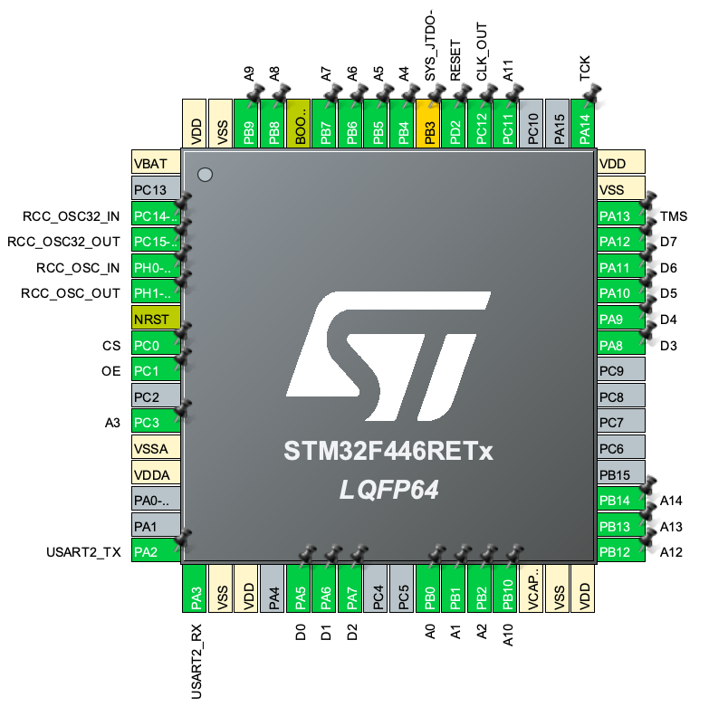
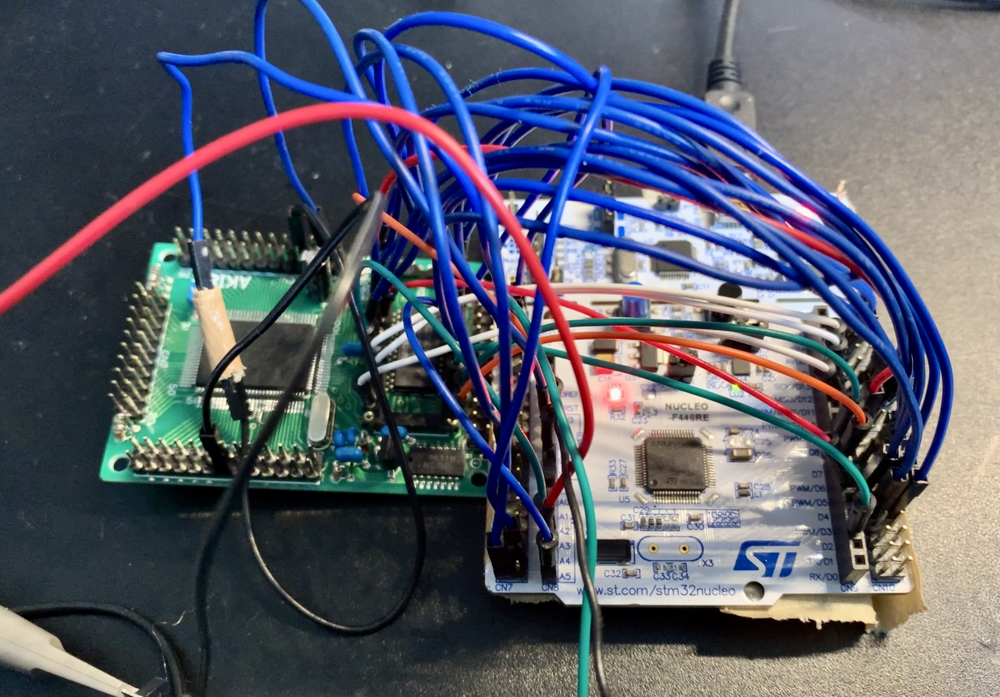

# stm32-z80-rom-emu
AKI-80のROMをSTM32F446REでエミュレートする。  
これにより、UV-EPROMを用意せずともst-link経由で書き込むだけでAKI-80をプログラミング可能

## 開発環境
- CubeMX 6.7.0

## 使用機材
- AKI-80
- NucleoF446RE

## 使用ツール
- gcc-arm-none-eabi
- Z80用クロスコンパイラ
    - [sdcc](https://sdcc.sourceforge.net/)
- Python
    - [IntelHex](https://pypi.org/project/intelhex/)
    - クロスコンパイラが生成したIntel Hexをcのソースファイルに変換するために使用

## 配線など

※プロトタイプ、という言い訳

## How to build
- `mkdir build`
- `cd build`
- `cmake ..`
- `make asm_write`
    - この時、z80/main.asmが自動でコンパイルされ、st-linkで書き込まれる
